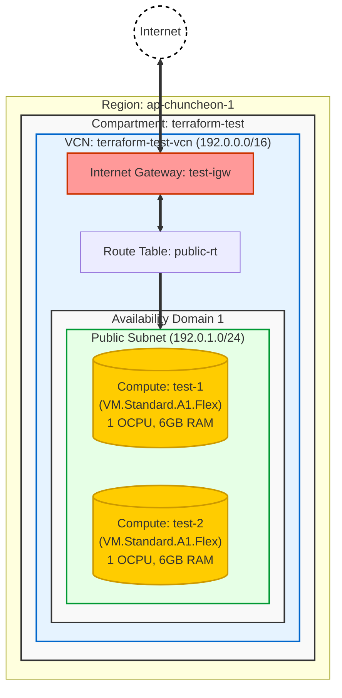

# OCI Infrastructure Architecture

이 문서는 Terraform을 통해 구축된 현재(`2026-01-30` 기준) OCI 인프라 아키텍처를 시각화한 것입니다.

## Infrastructure Diagram

## Resource Details

| Resource Type | Name | CIDR / Spec | Description |
| :--- | :--- | :--- | :--- |
| **Region** | ap-chuncheon-1 | - | 춘천 리전 |
| **VCN** | terraform-test-vcn | `192.0.0.0/16` | 메인 가상 네트워크 |
| **Subnet** | public-subnet | `192.0.1.0/24` | 외부 접속이 가능한 Public Subnet |
| **Gateway** | test-igw | - | Internet Gateway (인터넷 통신용) |
| **Compute** | test-1 | VM.Standard.A1.Flex | Oracle Linux 9 (ARM), 1 OCPU, 6GB RAM |
| **Compute** | test-2 | VM.Standard.A1.Flex | Oracle Linux 9 (ARM), 1 OCPU, 6GB RAM |
