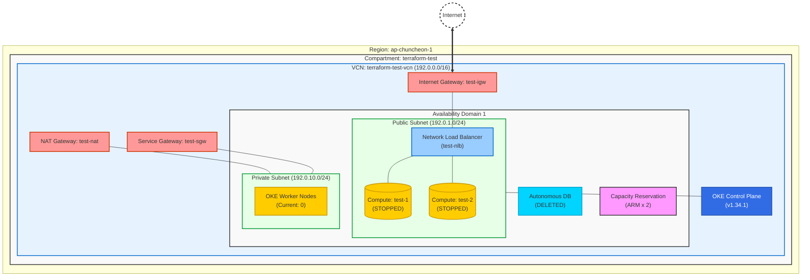

# OCI Infrastructure Architecture

이 문서는 Terraform을 통해 구축된 현재(`2026-02-05` 기준) OCI 인프라 아키텍처를 시각화한 것입니다.

## Infrastructure Diagram

## Resource Details

| Resource Type | Name | CIDR / Spec | Description |
| :--- | :--- | :--- | :--- |
| **Region** | ap-chuncheon-1 | - | 춘천 리전 |
| **VCN** | terraform-test-vcn | `192.0.0.0/16` | 메인 가상 네트워크 |
| **Subnet (Public)** | public-subnet | `192.0.1.0/24` | 외부 접속용 (NLB, Compute, OKE API) |
| **Subnet (Private)** | private-subnet | `192.0.10.0/24` | 보안 서브넷 (OKE Worker Nodes용) |
| **Network LB** | test-nlb | Layer 4 (TCP) | **Public IP: 168.107.38.86**, 포트 80 리스닝 |
| **Compute** | test-1 / test-2 | VM.Standard.A1.Flex | ARM (STOPPED), 현재 용량 예약 없음 |
| **Capacity Reserve**| test-arm-capacity-reservation | ARM (1 OCPU, 6GB) x 2 | **신규 생성**, ARM 인스턴스 용량 선점용 |
| **OKE** | terraform-oke-cluster | v1.34.1 | 클러스터 활성 상태, 워커 노드 0대 |