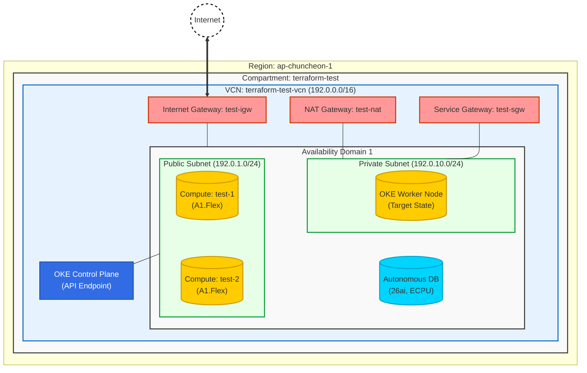

# OCI Infrastructure Architecture

이 문서는 Terraform을 통해 구축된 현재(`2026-01-30` 기준) OCI 인프라 아키텍처를 시각화한 것입니다.

## Infrastructure Diagram

## Resource Details

| Resource Type | Name | CIDR / Spec | Description |
| :--- | :--- | :--- | :--- |
| **Region** | ap-chuncheon-1 | - | 춘천 리전 |
| **VCN** | terraform-test-vcn | `192.0.0.0/16` | 메인 가상 네트워크 |
| **Subnet (Public)** | public-subnet | `192.0.1.0/24` | 외부 접속용 서브넷 (Compute, OKE API) |
| **Subnet (Private)** | private-subnet | `192.0.10.0/24` | 보안 서브넷 (OKE Worker Nodes 배치용) |
| **Gateways** | IGW / NAT / SGW | - | 인터넷 및 OCI 서비스 통신용 게이트웨이 세트 |
| **Compute** | test-1 / test-2 | VM.Standard.A1.Flex | Oracle Linux 9 (ARM), 현재 STOPPED 상태 |
| **Database** | test-autonomous-db | 26ai (ECPU) | Autonomous DB, 2 ECPUs, 현재 STOPPED 상태 |
| **OKE (Target)** | terraform-oke-cluster | v1.31.10 | 쿠버네티스 클러스터 (수동 생성 예정) |
